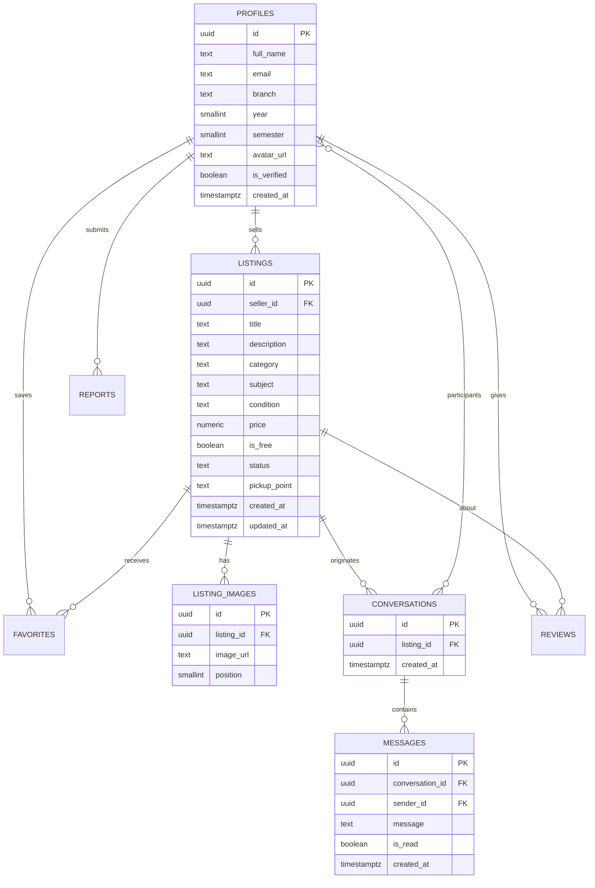

# SATI Swap — Domain Model

> **Status:** v1.0 | **Date:** Sep 15, 2026

This document defines the shared vocabulary for SATI Swap. Every team member and every agent working in this codebase should use these terms **exactly** as written. Map any other name you encounter back to these canonical terms.

---

## 1. Glossary (Canonical Terms)

| Term | Definition | Aliases to avoid |
|------|------------|------------------|
| **Student** | An authenticated SATI user with a verified profile. | user, member, person |
| **Profile** | The public identity of a Student: name, branch, year, semester, avatar, verified flag. | account, user row |
| **Listing** | A single item (book, notes, lab manual, etc.) offered for sale, exchange, or donation. | post, ad, item |
| **Category** | High-level grouping of Listings: Books, Notes, Lab Manuals, PYQs, Drawing, Calculators, Stationery, Other. | type, kind |
| **Condition** | Physical state of an item: New, Good, Fair. | quality |
| **Seller** | The Student who owns a Listing. | owner, poster |
| **Buyer** | A Student who is interested in a Listing. | interested student |
| **Conversation** | A chat thread between exactly two Students about one Listing. | chat, thread, dm |
| **Participant** | A Student who belongs to a Conversation. | member |
| **Message** | A single text entry inside a Conversation sent by one Participant. | dm, text |
| **Favorite** | A Buyer's bookmark of a Listing (saved for later). | save, wishlist item, bookmark |
| **Pickup Point** | A campus location where Buyer and Seller agree to exchange the item (Library, Main Gate, Cafeteria, Other). | meetup, exchange spot |
| **Exchange** | The act of transferring the physical item between Seller and Buyer. | sale, transaction, deal |
| **Review** | A 1–5 star rating + optional comment given after an Exchange. | rating, feedback |
| **Report** | A Student's flag of suspicious/inappropriate content or behavior. | complain, flag |
| **Verification** | The process that flips `is_verified = true` on a Profile. | approval, confirm |
| **Free / Donate** | A Listing with `is_free = true` and no price. | giveaway |
| **Status** | A Listing's lifecycle state: `active`, `reserved`, `sold`, `removed`. | state, stage |
| **SATI Swap** | The product itself. Also the brand. | BNS, BookSharp, the app |

---

## 2. Core Entities & Relationships

```
Student 1 ───< owns >─── * Listing
Student 1 ───< has >─── 1 Profile
Listing 1 ───< has >─── * ListingImage
Listing 1 ───< gathers >─── * Favorite (from Students)
Listing 1 ───< spawns >─── * Conversation
Conversation * <─── has ─── 1 Buyer  (via participants)
Conversation * <─── has ─── 1 Seller (via participants)
Conversation 1 ───< contains >─── * Message
Student 1 ───< writes >─── * Message
Listing 1 ───< receives >─── * Review
Student 1 ───< receives >─── * Review
Student 1 ───< submits >─── * Report
```

### Entity-Relationship Diagram (Mermaid)



---

## 3. State Machine — Listing Status

```
                    ┌────────────┐
                    │  created   │
                    └─────┬──────┘
                          │ (publish)
                          ▼
                    ┌────────────┐
          owner ──► │   ACTIVE   │ ◄── eligible for search/chat
                    └─────┬──────┘
              ┌───────────┼────────────┐
              │           │            │
      owner marks   buyer+owner    owner removes
      reserved       agree deal
              │           │            │
              ▼           ▼            ▼
        ┌──────────┐ ┌──────────┐ ┌──────────┐
        │ RESERVED │ │   SOLD   │ │ REMOVED  │
        └──────────┘ └──────────┘ └──────────┘
```

Rules:
- **active** → may be found in search, favorited, and chatted about
- **reserved** → excluded from search feed but still visible in the owner's "My Listings"; reserved time-bounds not yet implemented
- **sold** → terminal state (unless owner reactivates); kept for history & reviews
- **removed** → hidden everywhere; owner or admin sets this
- Only the owner (or admin) may transition states

---

## 4. Invariants (Rules the system must never break)

1. A Student's `semester` is always within 1–8 and `year` within 1–4.
2. A Listing price is `null` if and only if `is_free = true` (or `price = 0` with `is_free = true`).
3. A Listing belongs to exactly one Seller; only the Seller may edit/mark-sold/delete it.
4. A Conversation has exactly two Participants and references exactly one Listing.
5. A Message may only be written by one of the two Participants.
6. A Favorite is unique per (user, listing).
7. A Student may only Review once per (listing, reviewee).
8. `is_verified = false` Students may browse but **not** create Listings, send Messages, or start Conversations.
9. Deleted Profile → soft cascade: listings become `removed`, conversations archived, reviews kept (anonymized).
10. A Review can only be given after the Listing is `sold`.

---

## 5. Glossary Mapping Sources

Use these terms when interacting with the database tables:

| Domain term | DB table |
|---|---|
| Student / Profile | `profiles` |
| Listing | `listings` |
| ListingImage | `listing_images` |
| Conversation | `conversations` + `conversation_participants` |
| Message | `messages` |
| Favorite | `favorites` |
| Review | `reviews` |
| Report | `reports` |

## 6. Domain Ownership

- Every new feature/ticket **must** reference canonical terms from §1.
- No new term enters the codebase without being added to this glossary.
- When the DB column name differs from the domain term, the mapping lives here — same table maps every time.